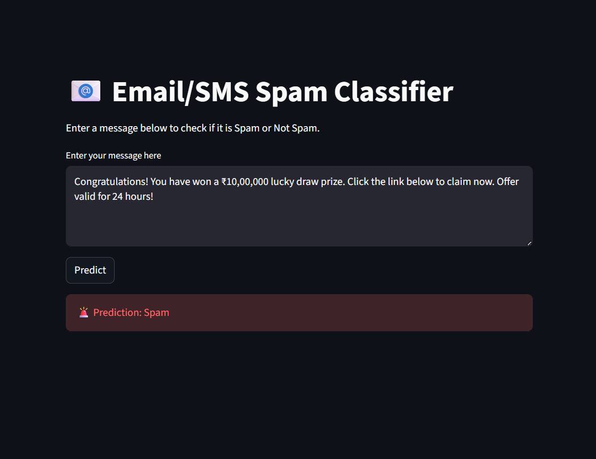
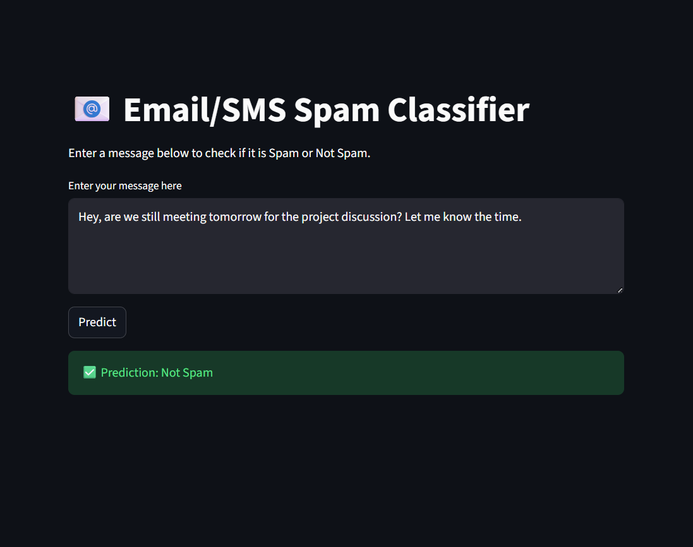
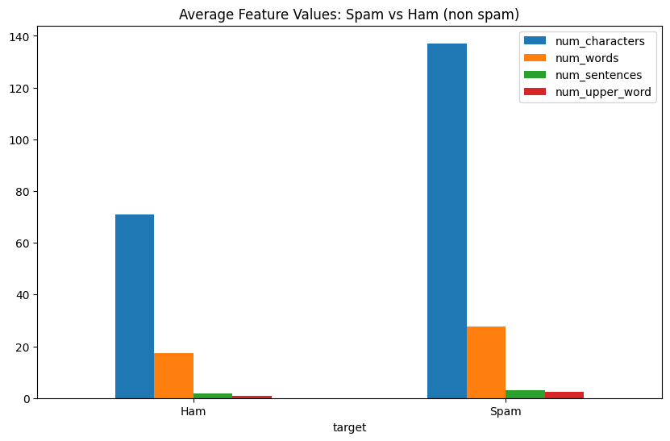
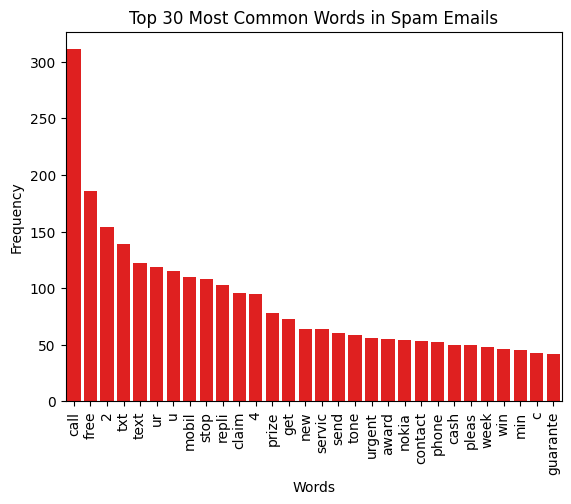
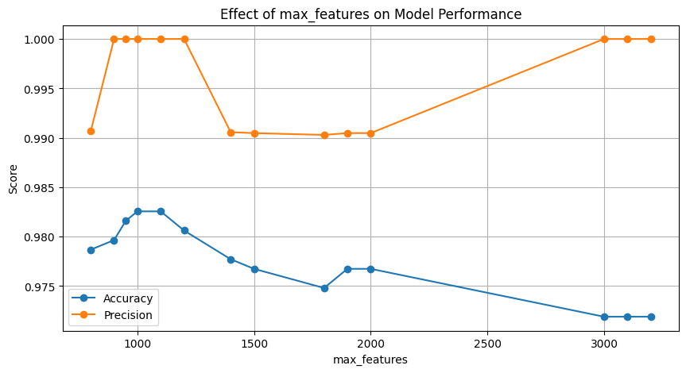
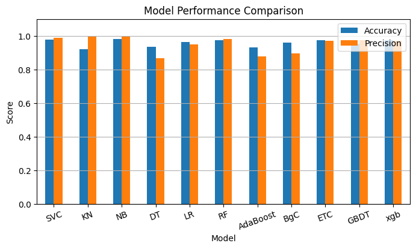

# 📧 Spam Detector Using Machine Learning

Spam Detector Using Machine Learning is an end-to-end NLP project that classifies messages as Spam or Ham. 
It includes EDA, text preprocessing, feature engineering, TF-IDF vectorization, model training, hyperparameter tuning, and performance comparison. The system achieves 98%+ accuracy and 1.0 precision.
* Live app preview-> https://spam-detector-ml.streamlit.app/
<p align="center">
  
  
</p>

---

## 📝 Project Overview

This project covers the complete pipeline for building a reliable spam detection system:

* Data cleaning
* Exploratory Data Analysis (EDA) with visualizations
* Text preprocessing
* Feature engineering
  * word count
  * sentence count
  * uppercase word count
* TF-IDF vectorization
* Model training & evaluation
  * GaussianNB
  * MultinomialNB
  * BernoulliNB
* Performance comparison
* Hyperparameter tuning (`max_features`)
* Model comparison and Selection
* Cross-validation and Hyperparameter tuning for MultinomialNB
* Exporting deployment-ready artifacts
  * `final_spam_classifier.pkl`
  * `tfidf_vectorizer.pkl`

---

## 🚀 Best Model

After comparing different Naive Bayes models and tuning TF-IDF features:

**Multinomial Naive Bayes**

* Best accuracy (98%+)
* **Precision = 1.0**, making it ideal for spam detection
* Selected with `max_features = 1100`

---

## 📂 Project Structure

```
spam-detector-ml/
│── data/
│── notebook/   → EDA + preprocessing + model building
│── artifacts/  → model.pkl, tfidf_vocab.pkl
│── app.py      → (optional future deployment)
│── README.md
```

---

## 📊 Visualizations Included

* Spam vs Ham distribution
* Spam vs Ham
  * Word count comparison
  * Sentence count comparison
  * Uppercase word patterns

* Most common words in Spam and Ham

* Word cloud
* Performance plots during tuning

* Best performing models
  

---

## ✔ Key Features

* High-precision spam prediction
* Deployment-ready artifacts
* Easy to extend into an API or web app

---

## ✅ Conclusion
This project illustrates a complete, practical workflow for building a high-accuracy spam detection system using classic machine learning and NLP techniques. By applying effective text preprocessing, feature engineering, TF-IDF vectorization, model comparison, and hyperparameter tuning, the final model achieves strong precision and reliability.
